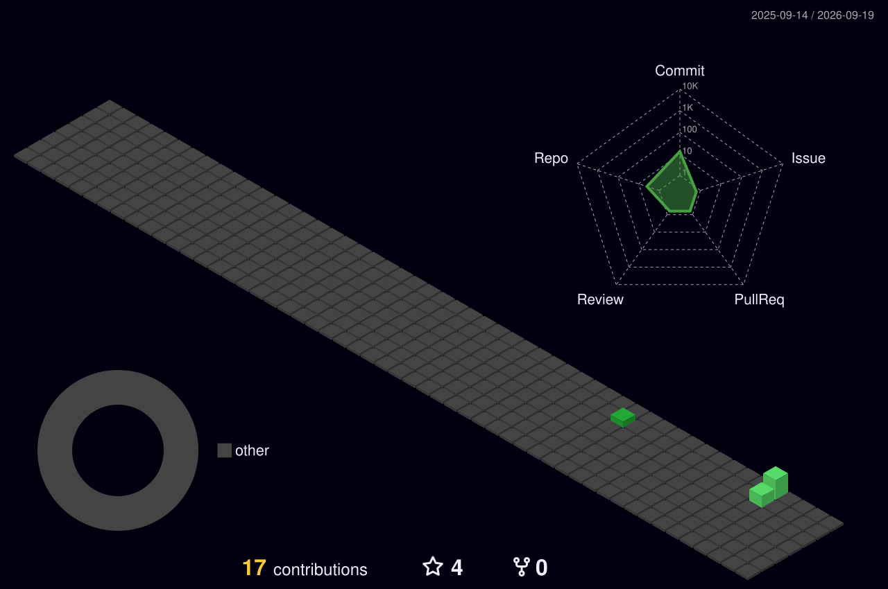

<!-- ═══════════════════ HEADER ═══════════════════ -->
<a href="https://app.hackthebox.com/public/users/3073012">
  
</a>

<div align="center">


<br>

<a href="https://app.hackthebox.com/public/users/3073012"></a>


</div>

<!-- ═══════════════════ WHOAMI ═══════════════════ -->
##  `whoami`

```python
class Xherogasm:
    def __init__(self):
        self.alias       = "xHerogasm"                 # everyone knows me by this
        self.role        = "Offensive Security Student"
        self.arena       = ["Hack The Box", "CTFs", "home lab"]
        self.currently   = "rooting boxes → OSCP + CPTS"
        self.focus       = ["Active Directory", "web exploitation", "privesc"]
        self.philosophy  = "enumerate everything, assume nothing"

    def every_day(self):
        return "one box, one lesson, zero excuses"      # discipline > motivation
```

<!-- ═══════════════════ ARSENAL ═══════════════════ -->
##  Arsenal

<div align="center">


</div>

<div align="center">

`nmap` · `ffuf` · `Burp Suite` · `Metasploit` · `Impacket` · `NetExec` · `BloodHound` · `Certipy` · `Hashcat` · `Evil-WinRM`

</div>

<!-- ═══════════════════ 3D CONTRIBUTIONS ═══════════════════ -->
##  Consistency, in 3D

<div align="center">

<!-- generated daily by the 3d-contrib GitHub Action -->


</div>

<!-- ═══════════════════ SNAKE ═══════════════════ -->
<div align="center">


</div>

<!-- ═══════════════════ STATS ═══════════════════ -->
##  Stats

<div align="center">


</div>

<!-- ═══════════════════ HTB + FEATURED ═══════════════════ -->
##  On the Box

<div align="center">

<a href="https://app.hackthebox.com/public/users/3073012">
  
  
</a>

</div>

<!-- ═══════════════════ PROJECTS ═══════════════════ -->
##  Featured Projects

<table>
<tr>
<td width="55%" valign="top">

### 🚩 [htb_writeups](https://github.com/xherogasm/htb_writeups)

Detailed, screenshot-rich walkthroughs of every **retired** Hack The Box machine I've rooted — full recon → foothold → root chains.

<a href="https://github.com/xherogasm/htb_writeups"></a>

`10 machines` · `Linux + Windows` · `Easy → Insane`

</td>
<td width="45%" valign="top">

### 🎓 University Projects

Coursework & personal builds — pinned on my profile.


</td>
</tr>
</table>

> 💡 Pin your best repos: **profile → "Customize your pins" → tick `htb_writeups` + your top uni projects.**

<!-- ═══════════════════ CONNECT ═══════════════════ -->
##  Connect

<div align="center">

<a href="https://linkedin.com/in/azyztns">
  
  
</a>
<a href="https://github.com/xherogasm">

  
</a>
<a href="mailto:mohamedaziztounci@gmail.com">
  
</a>

</div>

<!-- ═══════════════════ FOOTER ═══════════════════ -->

